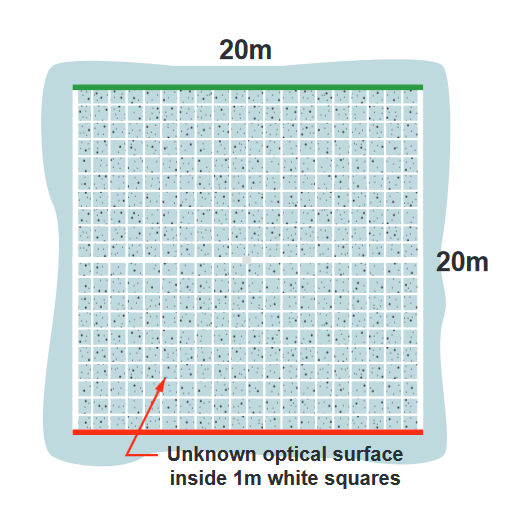

# Drone Vision

*Because you really shouldn't be flying blind*

This is a repository for the drone's computer vision module. The goal of this project is to create a program that can be fed a video stream from the done, and allow it to:

* Locate itself in the play area
* Locate the little robots 
* (Optional) Locate other flying drones

It is currently using [OpenCV](https://opencv.org/) with Python as a start. 

# Setting up

1. Setup pip for python (preferably python 3, but the code should run on 2).
2. Install opencv3.0 using pip.
3a. (If using a different camera) Calibrate your camera using a chessboard and the getCalibrationPics.py and calibrate.py programs. Replace the camera matrix and distortionCoefficients in GridSquares.py and Birdsview.py.
4. Run BirdsView.py. This will use whatever camera you have plugged in and will display a birds-eye view of the grid. Currently, the program requires a grid of 1.5 cm wide strips of black tape forming squares of length 28.5 cm, but this can be changed with just a few lines of code.

4b. Filenames can also be passed to the program.

# Contributing 

We use [Basecamp](https://3.basecamp.com/3292218/projects/577711) to coordinate goals and milestones. For smaller tasks,bugs, etc.., please check the [issues](https://github.com/STOC-Machine/vision/issues) tab to see what you can do!

# What the actual grid looks like

*A  square  arena  is  marked  on  the  ground in an indoor GPS-free arena.  This square arena will be 20 meters on each side.  The boundary  shall  consist  of  wide  white  lines bounding the sides of the square arena, with a wide red line on one end, and a wide green line on the other end as shown in the figure*

